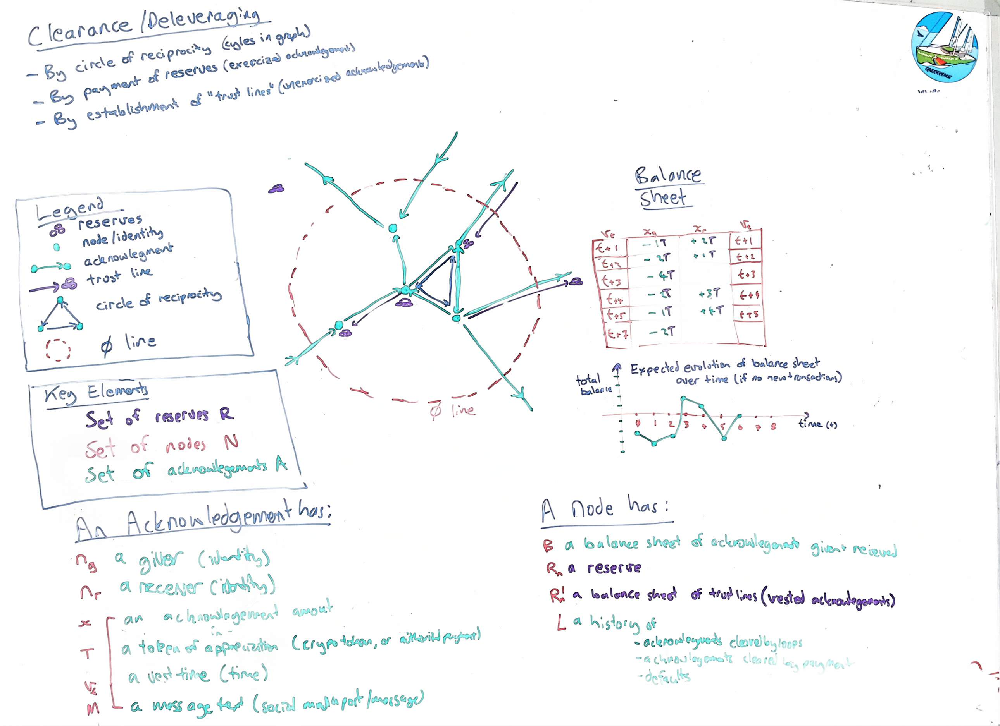

# KinPesa - A system of reciprocity 

## Contents:

- Introduction
- Acknowledgements
- Identity 
- Nodes
- Clearing and default
- Agents
- Trust lines
- Tokens
- Regarding decentralization
- Zero circle 

## Introduction

This is an attempt to create a framework to model (and simulate) markets with distributed information that allow for the creation of money like instruments (specifically 'credit/debt') without assuming a-priori the existence of centralized credit creating organisations like governments or banks. It also aims to avoid the assumption of any entities having global information.

This is also an attempt to define a general model on which various 'games' can be defined. The optimal outward form (UI and rules) of such 'games' is outside of the scope here, but the objective is that all games of interest could be defined on top of the basic structure described here. 

I am specifically interested in games which allow:
- the democratization of credit creation process
- for credit in the game to (nevertheless) retain value and be robust against shocks or boom/bust cycles
- for real value to be derived by participants of the game 
- for the experience of interacting with money/credit to be more gentle, and enjoyable (psychologically speaking)
- the celebration and acknowledgement of people that contribute to their community 
- the support of vulnerable persons that need help

At this point, no claim can be made that games built on top of this framework can achieve these objectives, but these objectives are still noted for the record. 

#### Assumption of 'commodity money'

In the following I do assume 'a-priori' the existence of 'tokens' or reserves that 'hold value'. These tokens could include bitcoin, crypto tokens, pre-authorized credit card transactions, or claims on bank credit, but could also be purely 'fictive' tokens. In the below when I refer to 'hard' currency I mean this to include all specie, M1, and (especially) any widely accepted crypto tokens. I consider these to be 'gold like' or 'commodity based' money.

For the discussion to proceed it is easier to assume these to exist a-priori. However, having once we have advanced the discussion to a certain point it should become clear that it would be possible - in certain types of game and if desired - to do away with the value holding tokens in various games and replace these with purely fictive (made up inside of the game) tokens for measurement of value. This is a bit like pulling up the ladder into an airship - at some point it is necessary to demonstrate that airship would be lighter than air - but in this case it is easier, first, to explain how it works while the air ship sitting on top of an existing building.

####  Key elements

We imagine a directed, weighted, graph with:
- A set of nodes - *N*
- A set of reserves - *R*
- A set of acknowledgements - *A*
- A set of identities - *I*

- Acknowlegements are edges between identities
- Identities 'point to' exactly one node
- A node has one or more identities
- Reserves are 'at' nodes
- 'Vested acknowledgements' are can also be referred to as 'trust lines' 

## Acknowledgements
 
An "acknowledgement" is, strictly, an edge between two identities. The identities can be thought of as just labels on the nodes, however, so in some contexts we may refer to acknowledgements between nodes. 

An acknowledgement has:

- *ig*: the giver (an identity)
- *ir*: the receiver (an identity)
- *M*:  a message text (text, image or attachment)
- *xT*: the acknowledgement amount (x) denominated in token T 
- *vt*: a vesting time (time)

The last two properties are optional. The message text can be empty if there is an amount specified.

To be considered valid an acknowledgement must be made available via a "post" to some sort of pseudonomous public transport.

For instance, the tweet: "Thanks @joe for the help in the garden last tuesday 2h" would be a valid acknowledgement. (Where the h refers to a fictive 'hours' token).

A bitcoin transaction can also modeled as an acknowledgement however - this time a hard currency acknowledgement with a vesting time of zero, that was immediately exercized. 

Up until the vesting time the acknowledgement is essentially just a 'promise to pay'. In the case of 'hard currency' tokens, after the vesting time the acknowledgement becomes a 'trust line' or a claim on the reserves at that token. A vested acknowledgement can be 'exercised' to transfer tokens to the receiving node or left un-exercized. 

The exact meaning of 'default' is discussed in more below but as a first approximation if a trust line is exercized and there is not sufficient reserves the acknowledgement is considered to be in default. 

It is also possible - with agreement of all parties in the chain - to formally 'write off' or 'de-leverage' acknowledgements which form a cycle in the graph (called a 'cirlce of reciprocity' before the vesting time. 

It is not necessary for acknowledgement amounts to be revealed to public but they can help guide what types of 'circles of reciprocity' are likely to be accepted.

#### Sitting on top of existing distribution networks

To allow this 'game' to be distributed by posts on top of existing public/social media neither the sender or receiver to have signed up with any third party service before they send or receive an acknowledgement. 

That said, it is expected that most senders will have interacted with third party apps at some point. Third party apps can help guide them to appropriate formatting of the message (and provide other useful services to them as well). By contrast, it is expected that recipients of acknowledgements may often be first exposed to the overall concept/introduced to the 'game' when they receive their first public acknowledgement. 

For instance a post on social media "thanks so much Joe for helping us move, here's a token to pay it forward" with an associated image and a link for more info on how to claim the token and thus join the game. 

 

As discussed below third party apps may also play a role 'validating' messages. The extent to which this is possible to do on messages delivered on existing transports, depends on the amount of met data allowed in the channel. In some contexts, for some information it may be necessary to use proxy identities, as discussed below. 

However, generally speaking it is critical that neither sender nor receiver need to utilize any centralized third parties, or apps in order to interact with 'games' defined in this way.

##  Identity 

An 'identity' is any form of meta data that establishes the *signing authority* of the **sender** (a post on a public timeline, a public/private key pair) or something which clearly *identifies* the intended **recipient** (for instance referring to a user by their @handle). 

#### Claiming nodes 

A node is considered to exist as soon as an acknowledgement pointing to it is created (and observed). A node may, in fact never make any signed statements using the identity pointing to it. Such 'unclaimed' nodes can have only one identity.

A recipient node created in this way can be 'claimed' at any time by someone with signing authority over the identity in question. 

#### Merging identities 

Once a node has at least one signed identity that node can be merged with another creating a single node with multiple identities. They do ths by publishing relevant signed public messages under both accounts indidcating that both identities acknowledge the other. An identity may also repudiate another identity (causing a node split). 

One reason that the difference between nodes and identities is important only because acknowledgements are from and to identities but reserves and reputations are calculated against nodes. 

#### Identity proxy 

Acknowledgements can also be sent via private message, or through a third party, but in this case some form of (potentially anonymized) public record must then be made available. For instance, a PM to a private facebook chat another user may also be monitored by a bot invited to that group who would then repost a (possibly pseudo/anonymized) representation of that acknowledgement with a signature proof indicating that the message was from the original sender (or at least that the sender trusted the app to post on their behalf).

## Nodes

A node has:
- *{i}*: 1 .. n identities 
- *B*: a balance sheet of acknowledgements received and given
- *R*: a reserve of hard currency tokens 
- *R'*: a balance sheet of trust lines (vested acknowledgements)
- *L*: a public history of outstanding, cleared acknowledgements, exercized trust lines and defaults etc.

While a node can be pseudonymous it is assumed in this first iteration, that the balance sheets (B) and history (L) are publically visible, by appropriate querying of the public record. "Validated" acknowledgements or trust lines can also be shown to cryptographically control or have access to reserves on the public blockchain/s. This combination of information, combined with other information in the public record allows for reputation and (essentially) credit scores to be built up for nodes by other nodes (or agents acting on behalf of those other nodes).

## Clearing and default

There are two ways of 'clearing' an acknowledgment. Either a circle of reciprocity can be found and agreed to or the acknowledgement can be cleared by vesting of the claim on the hard currency token (creating a trust line). 

#### Clearance by payment or vesting

If an acknowledgement has a 'hard currency' token and a vesting date the sender is basically making a 'promise to pay' the amount of token specified at the vesting date *or* to find a circle of reciprocity before that date. Otherwise they default.

An acknowledgement is considered to be backed and 'in the money' if the receiver can algorithmically verify the givers ability to pay and they can verify the contract exists which will gaurantee payment of the token is made at time of vesting (vt) - providing only that claimable reserves at the node (R') remain above their acknowledgement amount (x) at that time. 

If an acknowledgement is measured in 'hard currency' but not backed algorithmically or if it is not 'in the money' the node is still making a 'promise to pay' but there is less certainty that the node will be able to support the hard currency amount by that vesting date.

In the case of 'hard currency' promises third party apps may also verify or 'validate' that a contract is 'in the money' and backed by an alogorithmically enforceable contract. They might stamp or validate the message in such a case.

At the time of vesting an algorithmically enforced acknowledgement can be exercized so that the token is transferred into the direct control of the receiver (expanding their direct reserves R) or the acknowledgement can be left unexercized, creating a trust line (and expanding their indirectly claimable reserves R').

This type of clearance is only really possible with algorithmically enforced acknowledgements in 'hard currency'.

#### Circles of reciprocity 

Any type of acknowledgement can be cleared by the 'circles of reciprocity' method. 

Specifically, if a loop of active acknowledgements is found, having roughly equal value, all of the relevant nodes in that loop are offered the chance to 'write off' acknowledgements they have recieved in return for acknowledgements given.

If all parties agree the acknowledgements are 'cleared'. At this time any algorithically enforced contracts no longer have the possiblity to make a claim on reserves. Either way this agreement to 'write off' is noted in the public ledger by signed messages from all parties. 

It is expected that the mechanics of this would often be handled by an automated agent or app acting on behalf of the node, though this is not a requirement.

If an acknowledgement has a 'fictive' token (not backed by hard currency), and a vesting date, the sender is basically making a promise to resolve the circle of reciprocity prior to the vesting date or be in default. 

However clearance by 'circle of reciprocity' can also happen with hard currency acknowledgements, whether backed algorithmically or not (or including a mix of the two).

In the case of clearance in this way the acknowledgement amounts (xT) are used *only* as a 'measure of value' and a guide to what types of 'circles of reciprocity' are likely to be accepted by the parties involved. The token acts, in this case, in the same way that a 'roman coin' was used as a standard measure of value on debt contracts in Medieval Europe long after the roman coins themselves had fully passed out of circulation.

One example of a 'fictive' tokens would be "hours". In this case the promise to pay is an offer for the giver to do x hours of work. Another forms of fictive token would be 'a bottle of red wine', 'bags of lemons' or 'a ride' etc. A range of different purely arbitrary measures of value could used (or invented) by people as methods of measurement. They would retain meaning and 'value' only because they would need to be cleared by the clearing of reciprocity loops or else do harm to the reputation (ability to have their requests fulfilled) of the giver.

It is not even necessary for there to be any acknowledgement amount (x) or token (T) at all. By examining the text of the messages alone, using NLP techniques or by hand, it would be possible to find loops which nodes (or agents acting on behalf of nodes) may consider likely to be acceptable for closure. For instance a 'saturday sports ride sharing' app might consider all messages acknowledging 'a ride' to be basically equivalent in value and act accordingly (see below around notifications).

It is also possible that the acknowledgement amounts could be selectively revealed only to the agents looking to find loops. (This would be done for psychological reasons, as sometimes people prefer to be discreet about such things)

#### Liquidity

With circles of reciprocity the idea is that nodes (or agents) would cross off what they consider to be 'roughly equal' acknowledgements. 

Nodes would also have visibility on the entire chain of acknowledgements and nodes involved (with a variable degree of anonymity). In this way they could choose to veto acknowledgement chains incorporating uses of their 'money' that don't align with their values. For instance they may have their agent boycott any acknowledgement chains passing through arms companies, or perhaps through anonymous parties or through nodes which are too highly leveraged. This would decrease liquidity for parties they do not support (and increase liquidity to those they do) even if they are distant to them in economic terms.

To increase liquidity - especially in the case of 'unbacked' acknowledgements - it is not regarded as necessary that the acknowledgement amounts (xT) on a circle of reciprocity be of exactly the same value, of the same type, or indeed that there are any kind of token measure at all - as described above. Generally there is liquidity in the fact that people belive in 'swings and roundabouts'.

Alternatively, one of the advantages of 'hard currency' contracts, algorithmically enforced, is that unequal amounts can be partially cleared up to the minimum flow across the loop but using exact values thus increasing liquidity, though this potentially can leave 'dust' transactions.

## Agents

The usual way to do clearances would be automatically via an 'agent' or 'app' that can make judgements on behalf of the user however the user would have the option to choose what app to trust, and/or to review specific clearance requests. 

As a way to fund agents or apps, they could attempt to find loops where all parties are happy to accept the trades on both sides, but there is overall a downward trend, thus allowing the app to insert itself into the chain and pocket the difference. (Essentially a form of arbitrage, but also something that the user of the app may be willing to do)

To encourage reciprocity loops and to make things fun prizes could be awarded for 'longest chain', 'most geographically distributed', or 'largest value' of loops closed in this way. Perhaps on a leaderboard.

As noted below, clearing acknowledgements by circles of reciprocity is rationally advantageous to nodes (and to be preferred over the alternative of default or clearance by payment). For this reason apps would also play a role in notifying users of any opportunities to do this (see below section on notification and reputation).

## Trust lines

Vested acknowledgements don't have to be exercized right away. In the case of 'backed' acknoweldgements (only) this creates a 'trust line' essentially giving the recipient node a claim on the reserves of the giving node at any time after that. 

It may appear that it would make sense to immediately exercize any vested acknowledgements. In the case of nodes which you are unlikely to interact with in future - ie strangers - it is unarguably true that the rational choice is to exercize the claim straight away. When used as a form of 'payment' to strangers outside the close support network - for instance if used to purchase bread at the dairy - this would be the expected behavior.

#### Rationality of trust line networks

However, in the case of others in your close network (neighbors, friends or family) it could be the strictly rational choice to keep an unexercized trustline open. Doing this creates an incentive on the part of the giving node to ensure that the recipient (you) is not going to **need** to exercize their trustline in future. Essentially leaving a trustline open is a form of collective insurance or collective responsiblity against unexpected events. This is similar to the way that the Tiv people of Africa were described (in [Debt: The first 500 years](https://en.wikipedia.org/wiki/Debt:_The_First_5000_Years) as wanting, over the long term, for neighbors to reciprocate on gifts given but at the same never to quite get back to 'zero' thus symbolizing the ongoing existence of a relationship. Rationally speaking, however, a node needs to weigh this dynamic against the 'tragedy of the commons' dynamic that it makes sense to grab your share of the reserves from before another party does the same. It also creates a 'run on the banks' danger which still exists, although in a more diffuse form on such a network. Rational actors may choose to exercize their trust lines simply to reduce leverage in their surrounding network.

#### Transitivity of trust lines 

Trustlines should be transitive in the following sense:

When payment is made *outside* of the immediate trust network the expectation is that this would draw down reserves within the reachable trust graph (R') for that node. The exact details of the underlying smart contracts remain to be worked out but it would certainly be possible to set up contracts that allow for the draw down to be made from a range of reserves within the wider reachable reserves (R') without necessarily exhausting the local reserves (R) first. 

#### Support for vulnerable people

Putting aside 'rational' choices (in game theoretic sense) as stated above it is regarded as desirable for games built on this framework to *allow* for the support of vulnerable people (who may or may not be in the kin group of the giver). Perhaps it is only 'irrational' because the game theory is not sufficiently developed, or perhaps this is a true limitation of game theory. Either way it is a goal of this system that games could be built where young people, old people, and generally people unable to maintain reciprocity entirely on their own terms should still be able to be supported. Ideally the interaction with 'money' and credit need not feel so cold/harsh and rigid, while still retaining the value of that money.

One way this could be achieved is simply to extend a trust line to another node without that node doing something that requires acknowledgement first. In this way when the receiving node (the vulenerable person) makes an acknowledgement it potentially draws down from the reachable reserves of the giving node but by the same token, provided their is reciprocity before the vesting date - for instance against other vulnerable persons - the reserves need not be drawn down at all. If a number of people extend a trust line to such persons then their reachable reserves are increased. 

The ability to revoke a trust line and how that might work is not something that has yet been figured out. 

## Notifications, and incentives 

#### Preference to deleverage 

It is in the interest of nodes to preferentially de-leverage their acknowledgements balance sheet (B) ahead of paying down their reserves (R). 

This is because - assuming rational risk analysis by other nodes - reserves act as 'high powered money' (in the economics sense) and have a multiplier effect on the ability to expand their acknowledgements balance sheet.

As a result nodes are incentivized to attempt to 'close the loop' and reduce both the leverage of their overall balance sheet (B) and to try and keep the total balance of their balance sheet positive. They can do this in two ways:
- They can let nodes in their near local network know about opportunities to help each other (and potentially create an acknowledgement loop back into an received acknowledgement already on their balance sheet).
- The can attempt to receive new acknowledgements which will ultimately be balanced off their outstanding acknowledgements.

#### Notifcations 

For this reason they want to use apps or agents that can find and notify them, preferentially, of any requests for assistance from people who are able to help them build a chain back to the recipient/s of their existing outgoing acknowledgement/s. They also want to notify people in their local network of opportunities that will do the same.

They might do this by 'vouching' for another party to a third party who knows that party less well than they do.

They may also want to simply receive notifications of requests for help where they are able to help (but also where new acknowledgements from the person being helped is likely to lead to circles of reciprocity being created). Essentially they are looking for opportunites to 'pay back' the benefit they have already acknowledged. 

To maximize the chances of a closed loop they want to engage preferentially with nodes that are:
(a) close, in a network sense, to the nodes to which they have outstanding acknowledgement debts
(b) that are likely themselves to engage with other nodes in a way likely to create further acknowledgements. 

One way to measure the likelihood of (b) is to measure the number of defaults vs the number of closed loops in the history (L) of another node. Essentially this creates a further reputation incentive for nodes to attempt to close their outstanding acknowledgements without default.

The exact mechanism by which requests for help are shared or by which nodes can 'vouch' for another are outside the scope of this document and considered to be part of the UI of any game that could potentially be built 'on top' of this layer.
 
#### Defaults and reputation

As noted above if an acknowledgement has not been cleared by its vesting date then it is considered a default and removed from the list of 'active' acknowledgements. 

Default need not be a major problem for the giving node in question. However it will decrease the reputation (in terms of willingness of other nodes to interact with that node).  

It is also important for resilience of the system for acknowledgements that cannot or will not be honoured to be removed from the graph as early as possible. For this reason an acknowledgement with a very long vesting period, that has not been cleared after a long period, may be considered equivalent to a default for reputation purposes.

It would also be possible that acknowledgements dont have a vesting cliff but a vesting schedule so that older acknowledgements are discounted over time. Or equivalently, for reputation purposes older acknowledgements, without a token or with a 'fictive' token, could simply become worth less over time and be less 'high up' in notifications.

## Tokens

As already discussed an acknowledgement token can take many forms. Specifically tokens used in acknowledgements can be :
- 'Hard currency', algorithmically enforced to a block chain
- 'Hard currency' but not enforced (not backed)
- 'Fictive' (just known words) and therefore not backed
- Not present at all. 

I realise its not traditional to use the word 'hard currency' to describe crypto tokens but in the context of this paper they are, for obvious reasons, a lot more 'hard currency' than the graphs of acknowledgements described here. Crypto currency also has the advantage of allowing algorithmic and immediate enforcement of the type of semi-complex logic described here.

The exact choice of crypto currency is up to the next layer but it may be preferable to use 'stable coins' or a basket of currencies. 

It is also to algorithmically enforce a contract based on, for example, a pre-authorized credit card but this would introduce the fragility of having to trust a third party to do this. 

## Regarding decentralization

As a goal, even though users can choose which 'app' they use and there is no central store of data, the intention is that the incentive strucure is set up in such a way that the apps do not need to enforce 'good' or prevent 'negative' behaviors that the users of the app may wish to do. That is, it is vital that there should be no incentive for a user install an app with 'cheat codes' because it is in the interest of the players to keep playing the game in a way that is potentially beneficial to other players and/or to install apps that prevent interaction with players or apps that attempt to subvert this paradigm by spam or other methods of attack. 

As stated above it is also the intention that the overall system should allow games to built that are viral in nature but still allow for the creation of tokens that are stable in value.

## Zero circle/s

The claim is made that, for every node, provided all transfers of value are included in the network there exists a network distance or rather a network cut beyond which the total of acknowledgements plus reserves transferred in and acknowledgements plus reserves transferred out will not only tend towards zero in the longer term but will stay near zero over time. 

In the same way that gravitational acceleration is due to the total mass within a given volume and irrespective of the details of the distribution of mass within that volume the claim is made that there exists a certain boundary beyond which the details of the internal network are no longer relevant.

The reasoning behind this is that at a certain distance nodes will not consider other nodes to be in their local kinship network so that it makes sense for acknowledgements, or the overall balance sheet in hard currency terms, to be zero across the boundary. 

If demonstrably true this opens up opportunities for further network analysis.

